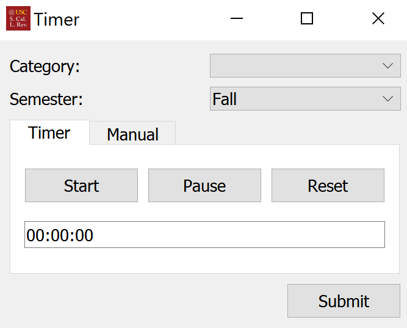

# USC Law Review Timer

## Build Instructions

1. Log in to your journal's google account.
2. Go to [google console](https://console.developers.google.com/)
3. Copy the [template](https://docs.google.com/spreadsheets/d/1LM_xgAZS8uuNfkD0j4GKfggwWnJNnjL7xkg4PWGkgsY/edit?usp=sharing)
   to your journal's drive
